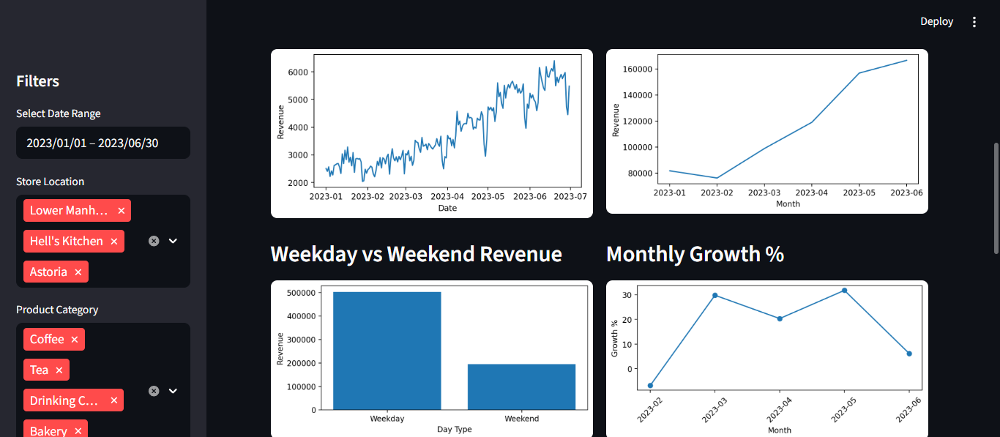
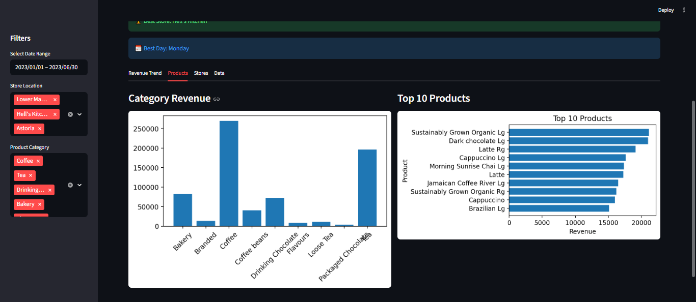

# ☕ Coffee Shop Sales Dashboard

An interactive **data analytics dashboard** built using **Streamlit, Pandas, Matplotlib, and Seaborn** to analyze and visualize coffee shop sales data.  
This project focuses on **data cleaning, business insights, and interactive visualization** to support data-driven decision making.


## 📸 Dashboard Preview

### 🔹 Main Dashboard
<p align="center">
  
</p>

### 🔹 Detailed Insights
<p align="center">
  
  
  
  
  
</p>

##  Project Overview

This dashboard provides a complete analysis of coffee shop sales, including:

- Revenue trends over time  
- Product performance analysis  
- Store-wise comparison  
- Customer behavior insights (time-based patterns)  
- Interactive filtering for deeper exploration  

The goal of this project is to transform raw transactional data into **meaningful insights using data visualization techniques**.


##  Tech Stack

- Frontend/UI: Streamlit  
- Data Processing: Pandas  
- Visualization: Matplotlib, Seaborn  
- Language: Python  


##  Features

###  1. Key Performance Indicators (KPIs)
- Total Revenue  
- Total Transactions  
- Average Transaction Value  
- Peak Sales Hour  
- Best Selling Product  
- Worst Performing Product  


###  2. Revenue Analysis
- Daily Revenue Trend  
- Monthly Revenue Trend  
- Monthly Growth Percentage  
- Weekday vs Weekend Sales  


###  3. Product Insights
- Revenue by Product Category  
- Top 10 Products (Horizontal Bar Chart)  


### 4. Store Insights
- Revenue by Store Location  
- Busiest Hours (Customer Traffic Analysis)  


###  5. Heatmap Visualization
- Sales intensity across:
  - Days of the week  
  - Hours of the day  
- Includes dropdown filters for:
  - Day  
  - Month  


###  6. Interactive Filters
Users can dynamically filter data using:
- Date range  
- Store location  
- Product category  


###  7. Data Export
- Download cleaned dataset directly from dashboard  


##  Data Preprocessing

The dataset is cleaned and transformed using:

- Removal of duplicate records  
- Handling invalid values (negative quantity/price)  
- Date & time formatting  
- Feature engineering:
  - Hour  
  - Day  
  - Month  
  - Revenue calculation  


##  Project Structure

```bash
coffee_shop_dashboard/
├── data/
│   ├── Coffee Shop Sales.csv
│   └── Coffee_Shop_Sales_Cleaned.csv
├── dashboard.py
├── requirements.txt
└── README.md
```
##  How to Run the Project

### 1. Clone the Repository
```bash
git clone https://github.com/your-username/coffee-shop-dashboard.git
cd coffee-shop-dashboard
```
### 2.Install Dependencies
```bash
pip install -r requirements.txt
```
### 3.Run
```bash
streamlit run dashboard.py
```
##  Sample Insights Generated

1. Peak customer activity occurs during specific hours of the day  
2. Certain product categories contribute significantly more revenue  
3. Weekend vs weekday patterns highlight customer behavior  
4. Monthly growth trends help identify business performance  


##  Learning Outcomes

Through this project, I gained hands-on experience in:

- Data cleaning and preprocessing  
- Exploratory Data Analysis (EDA)  
- Building interactive dashboards using Streamlit  
- Data visualization best practices  
- Structuring real-world data projects  


##  Future Enhancements

-  Add search functionality for products  
-  Enable chart download as images  
-  Add predictive analytics  
